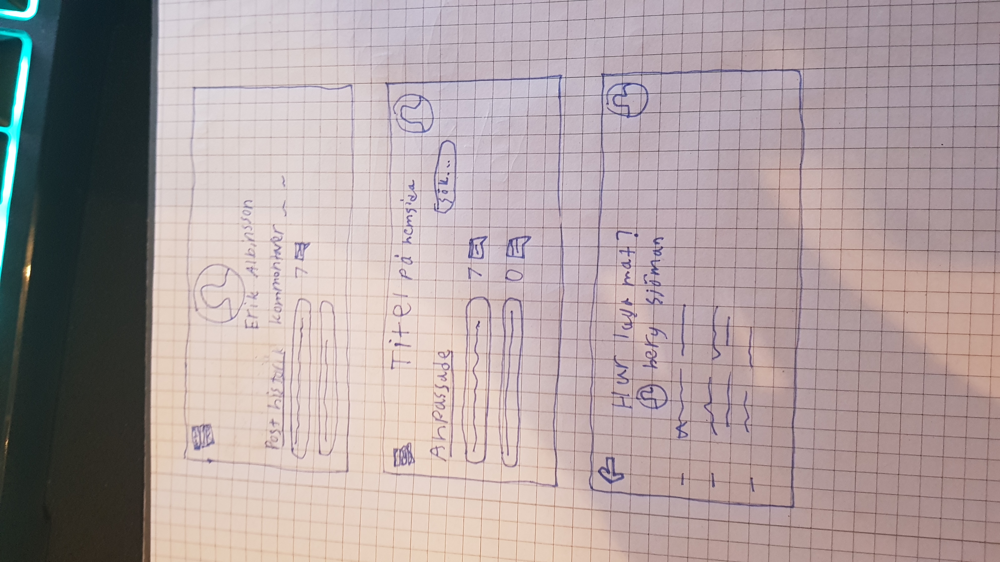
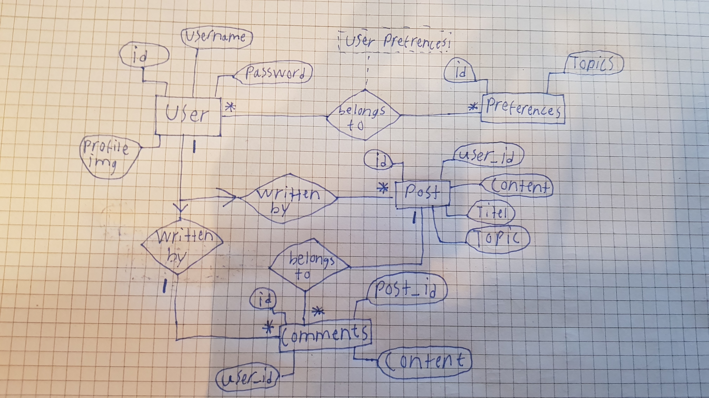

# Projektplan

## 1. Projektbeskrivning (Beskriv vad sidan ska kunna göra).
Jag ska göra ett forum, där man kan logga in och kostomisera ens profil där man exempelvis kan välja vilka kotegorier av forum posts man föredrar, så jag kan exempelvis välja "husdjur" och "motorcyklar" och så kommer jag ha ett personligt feed där folk som ställer frågor eller annat om just detta kommer dyka upp för mig. Därefter kan jag svara på dem eller hamna i en disskusion med andra användare. 
## 2. Vyer (visa bildskisser på dina sidor).

## 3. Databas med ER-diagram (Bild på ER-diagram).

## 4. Arkitektur (Beskriv filer och mappar - vad gör/innehåller de?).

